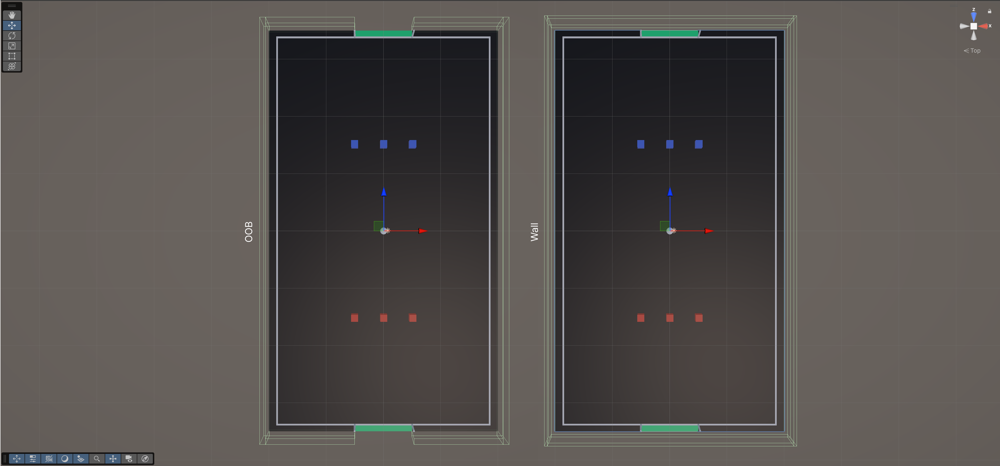

# Introduction

This project serves as a foundation for Multi-Agent Reinforcement Learning (MARL) within a soccer environment. The core design philosophy is the abstraction of physical complexity in favor of tactical decision-making, thus providing a clear signal for agents to learn higher-level coordination and strategy.

# 1. The Physical Environment

The environment is built with a hierarchical structure in Unity, rooted at the `EnvRoot` object.

```
EnvRoot
├── Pitch
|   ├── Ground
|   ├── FieldLine_N
|   ├── FieldLine_S
|   ├── FieldLine_W
|   ├── FieldLine_E
|   ├── Wall_N
|   ├── Wall_S
|   ├── Wall_W
|   └── Wall_E
├── OOBRoot
|   ├── OOB_E
|   ├── OOB_W
|   ├── OOB_NW
|   ├── OOB_SW
|   ├── OOB_SE
|   └── OOB_NE
├── Goal_A
|   └── GoalTrigger
|   ├── GoalArea_A
|   ├── GoalPostL_A
|   └── GoalPostR_A
├── Goal_B
|   ├── GoalTrigger
|   ├── GoalArea_B
|   ├── GoalPostL_B
|   └── GoalPostR_B
├── Ball
└── Teams
    ├── Team_A
    |   ├── Player_A0
    |   ├── Player_A1
    |   └── Player_A2
    └── Team_B
        ├── Player_B0
        ├── Player_B1
        └── Player_B2
```

## 1.1 The Play Area

The `Pitch` group defines the Play Area: the **physical boundaries** and **surface layout** where the soccer agents and the ball are contained. 

- `Ground`: A static plane with a scale of 4:1:7, providing a total physical surface of 40m x 70m. 
- `Wall`: Physical barriers positioned slightly outside the visible pitch boundaries. They prevent agents and the ball from falling off the ground into the void.
- `GoalTrigger`: A collision-detecting volume located behind the goal line. Contact between the ball and this trigger serves as the final success state for an episode.
- `GoalPost`: Each goal is composed of two collidable cylinders. Since the current simulation excludes lofted kicks, a horizontal crossbar is omitted. These cylinders are physically active to simulate realistic "bounce-back" behavior when the ball strikes the post.
- `GoalArea`: Green rectangles placed at either end of the field. These act as clear indicators for the user to identify the scoring zones. They do not contain any trigger logic.
- `FieldLine`: Visual markers placed on the ground to indicate the standard boundaries of a soccer pitch.
- `OOBRoot`: The logical boundaries of the match. This system uses a series of intangible trigger volumes (OOB_E, OOB_W, etc.) to manage game state transitions.

The **"Full Clearance" Boundary Logic**: OOB triggers are placed exactly at the perimeter of the 40m x 70m ground. When the reset is triggered, the ball's innermost edge is 1.2m away from the trigger. This effectively creates a playing field of 37.6m x 67.6m (40−1.2×2 for width, 70−1.2×2 for length).

Visual Alignment: The FieldLines are placed slightly inward from the physical walls/OOB triggers. This ensures that when the user sees the ball completely cross the white line, the physics engine simultaneously registers the OOB hit, making the visual experience and the logic synchronous.



<p align="center"><i>Fig 1. A visual comparison between OOB and Wall objects</i></p>

## 1.2 The Ball and Agents

This section defines the dynamic entities that interact within the Play Area.

- `Ball`: The central objective of the game. Its *1.2m* diameter, combined with the placement of OOB triggers at the *40m x 70m* mark, creates an effective playing field of *37.6m x 67.6m* based on the "Full Clearance" rule.
- `Agent`: Decision-making entity (player) represented as Cubes. They are divided into *Team A* and *Team B*, each with a specific goal orientation.
    - `ControlPoint`: A designated child object (transform) located at the base/front of the agent. This represents the agent's "feet" or "sweet spot."

## 1.3 Physical Properties and Simulation Constants

### 1.3.1 Physic Materials

| **Object** | **Dynamic Friction** | **Static Friction** | **Bounciness** | **Friction Combine** | **Bounce Combine** |
| --- | --- | --- | --- | --- | --- |
| `Ground` | 0.8 | 0.8 | 0 | Multiply | Minimum |
| `Ball` | 0.6 | 0.6 | 0.2 | Multiply | Maximum |
| `Player` | 0.9 | 0.9 | 0.05 | Average | Average |
| `GoalPost` | 0.4 | 0.4 | 0.7 | Average | Maximum |

### 1.3.2 Rigidbody Settings

| **Object** | **Mass** | **Linear Damping** | **Angular Damping** | **Interpolate** | **Collision Detection** | **Freeze Rotation** |
| --- | --- | --- | --- | --- | --- | --- |
| `Ball` | 0.4 | 0.08 | 2.5 | Interpolate | Continuous Dynamic | N/A |
| `Agent` | 75 | 3 | 6 | Interpolate | Discrete | X and Z |

# 2. Logic and Implementation

This section details the C# scripting architecture that governs individual entities and the overall game flow.

## 2.1 BallController

The `BallController` script is responsible for managing the ball's physical state, tracking ownership, and acting as the primary trigger for game events like goals or out-of-bounds violations. It bridges the gap between raw physics and the tactical rules of the simulation.

### 2.1.1 Inspector Settings and Reference

The script begins by defining the necessary connections to other system components and the configurable parameters that tune the ball's interaction logic.

```c#
[Header("References")]
public EnvController envController;
public Rigidbody rb;

[Header("Status (Read Only)")]
public AgentController lastTouchedBy;
public int lastTouchedTeam = -1; 
public string lastActionType = "None";

[Header("Analyst Settings")]
[Tooltip("Radius around the ball where an agent is considered 'In Contest'.")]
public float influenceRadius = 1.2f; 
public LayerMask playerLayer;
[Tooltip("Time in seconds to ignore collisions from the kicker immediately after a kick.")]
public float kickIgnoreDuration = 0.15f;
```

**Key Components**:
- `envController`: A direct link to the environment manager. The ball uses this to report high-level events (Goals, OOB).
- `rb` (Rigidbody): The handle for the physics engine, allowing the script to manipulate velocity and detect collisions.
- Status Fields: `lastTouchedBy`, `lastTouchedTeam`, and `lastActionType` act as the ball's "memory." They are crucial for crediting rewards properly (e.g., determining who scored a goal or caused a turnover).
- Analyst Settings:
    - `influenceRadius`: Defines the zone around the ball where an agent is capable of controlling it. 
    - `kickIgnoreDuration`: A physics tuning parameter. When an agent kicks, the ball ignores physical collisions with that specific agent for a split second to prevent it from getting stuck inside their collider or "glitching" due to overlapping physics volumes.

### 2.1.2 Lifecycle and Initialization

This section governs the "Reset" state, ensuring the ball starts every episode in a clean, neutral state to prevent physics bugs or reward exploitation.

```c#
public void ResetBall(Vector3 localPosition)
{
    // 1. Kill all momentum immediately
    rb.linearVelocity = Vector3.zero;
    rb.angularVelocity = Vector3.zero;
    
    // 2. Set position relative to the parent environment
    transform.localPosition = localPosition;
    
    // 3. Reset tracking data
    lastTouchedBy = null;
    lastTouchedTeam = -1;
    lastActionType = "None";
    
    ignoreAgent = null;
    ignoreTimer = 0f;

    // 4. Force Physics sync so the engine knows the ball moved
    Physics.SyncTransforms();
}
```

### 2.1.3 Interaction Logic (The Sensor)

This section details how the ball handles physical contact and the specific "kick" mechanics that bridge the gap between agent intent and physics engine response.

```c#
public void RegisterKick(AgentController agent)
{
    SetOwnership(agent, "Kick");
    ignoreAgent = agent;
    ignoreTimer = kickIgnoreDuration;
}

private void OnCollisionEnter(Collision collision)
{
    if (collision.gameObject.CompareTag("Player"))
    {
        AgentController agent = collision.gameObject.GetComponent<AgentController>();
        if (agent != null)
        {
            // If this is the agent who just kicked, ignore the immediate physical recoil
            if (agent == ignoreAgent && ignoreTimer > 0f) return;
            
            SetOwnership(agent, "Touch");
        }
    }
}
```

**The Kick Mechanism** (`RegisterKick`): When an agent executes a kick command, this method is called. It tags the agent as the owner and initiates a kickIgnoreDuration (0.15s).

>Note: This timer creates a "ghosting" effect where the ball temporarily ignores collisions with the kicker. This is essential to prevent the ball from instantly colliding with the kicker’s own collider upon launch, which would otherwise cause the ball to stall or glitch.

**Collision Detection** (`OnCollisionEnter()`): This handles all other physical contacts (dribbling, incidental touches, or deflections).
- The Safety Check: It checks if the colliding agent is the ignoreAgent. If the timer hasn't expired, the collision is ignored to ensure a clean launch.
- Touch Registration: If the contact is valid, the ball updates its lastTouchedBy status to "Touch," providing the data needed for future reward attribution.

### 2.1.4 Analysis Logic (The Analyst)

While physics handles the "thump" of the ball, the Analyst logic handles the "rules" of possession. This runs every FixedUpdate to provide the EnvController with a constant stream of tactical data.

```c#
private void FixedUpdate()
{
    // Handle kick cooldown timer
    if (ignoreTimer > 0f)
    {
        ignoreTimer -= Time.fixedDeltaTime;
        if (ignoreTimer <= 0f) ignoreAgent = null; 
    }

    if (envController == null) return;
    
    // Efficiently find all colliders near the ball
    // Radius is expanded slightly to ensure we catch agent control points
    playersInRange = Physics.OverlapSphere(transform.position, influenceRadius + 1.0f, playerLayer); 

    UpdatePossessionPhase();
}

public void UpdatePossessionPhase()
{
    bool team0InRange = false;
    bool team1InRange = false;
    List<AgentController> contenders = new List<AgentController>();

    AgentController closestAgent = null;
    float minDistance = float.MaxValue;

    // Reset the official count before calculating
    playersInRangeCount = 0;

    foreach (var col in playersInRange)
    {
        AgentController agent = col.GetComponentInParent<AgentController>();
        if (agent != null)
        {
            if (agent.CurrentState == AgentState.Restricted) continue;

            // --- POSSESSION LOGIC ---
            // Calculate distance from Ball to the Agent's CONTROL POINT (feet)
            float distanceToControl = Vector3.Distance(transform.position, agent.controlPoint.position);

            // If the control point is within the influence radius, they are "In Contest"
            if (distanceToControl <= influenceRadius)
            {
                playersInRangeCount++;
                
                if (agent.CachedTeamId == 0) team0InRange = true;
                if (agent.CachedTeamId == 1) team1InRange = true;
                
                if (!contenders.Contains(agent)) contenders.Add(agent);

                // Track closest agent for Deflection logic
                if (distanceToControl < minDistance)
                {
                    minDistance = distanceToControl;
                    closestAgent = agent;
                }
            }
        }
    }

    // Handle implicit "Deflection" ownership if an agent is close but didn't explicitly kick
    if (closestAgent != null)
    {
        if (closestAgent == ignoreAgent && ignoreTimer > 0f)
        {
            // Ignoring recent kicker
        }
        else
        {
            SetOwnership(closestAgent, "Deflection");
        }
    }

    // Send data to the referee (EnvController)
    envController.UpdatePhase(team0InRange, team1InRange, contenders);
}
```

**Spatial Query** (`Physics.OverlapSphere`): The ball performs a check for all objects on the playerLayer. We expand the check by +1.0m beyond the influenceRadius to ensure we catch the "Control Points" of agents who might be standing just outside the radius.

**Possession Logic** (`UpdatePossessionPhase()`): The script iterates through nearby agents and calculates the distance from the ball to the agent's Control Point. If an agent’s control point is within the influenceRadius, they are added to the contenders list.

**Implicit Deflections (Important)**: Even if no CollisionEnter was triggered, the Analyst identifies the closestAgent within the radius. It automatically updates ownership to "Deflection," ensuring that if a ball "wafts" past a player and goes into the goal, the closest player gets logical credit.

**Phase Reporting**: Finally, it informs the EnvController whether Team A, Team B, or both are in range. This allows the referee logic to transition the game state between Possession, Contested, or Loose.

### 2.1.5 The Reporter (Trigger Detection)

The final role of the `BallController` is the Reporter. While the other sections handle internal logic and physics, this section interacts with the environment's triggers to signal the end of a play or a transition in game state.

```c#
private void OnTriggerEnter(Collider other)
{
    if (envController == null) return;

    // GOAL DETECTION
    if (other.CompareTag("Goal_A"))
    {
        // Goal A hit -> Team B (Team 1) Scores
        envController.ResolveGoal(1, lastTouchedBy, lastActionType);
    }
    else if (other.CompareTag("Goal_B"))
    {
        // Goal B hit -> Team A (Team 0) Scores
        envController.ResolveGoal(0, lastTouchedBy, lastActionType);
    }
    // OUT OF BOUNDS DETECTION
    else if (other.CompareTag("OOB"))
    {
        envController.ResolveOutOfBounds(
            lastTouchedBy, 
            lastTouchedTeam, 
            lastActionType, 
            transform.position
        );
    }
}
```

**Goal Logic**: The ball detects contact with GoalTrigger volumes. It is important to note the Inverse Scoring: hitting Goal_A (the North goal) triggers a reward for Team 1 (South), as they are the attacking team for that goal.

**Ownership Attribution**: When a goal or OOB event is reported, the ball passes its "memory" (lastTouchedBy and lastActionType) to the EnvController. This allows the referee logic to know exactly which agent to reward for a goal or hold accountable for an out-of-bounds error.

**Coordinate Reporting**: For OOB events, the ball sends its exact transform.position. This is used by the environment to determine if the restart should be a Corner Kick, Goal Kick, or Throw-in based on where the ball exited the 37.6m x 67.6m play area.

## 2.2 AgentController